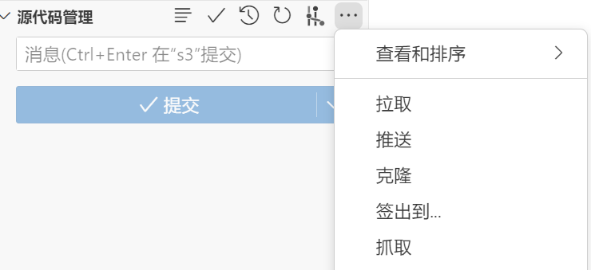
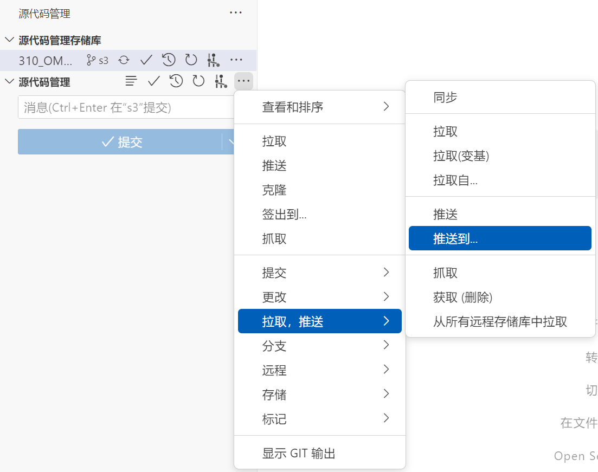

# 7、git的基本操作

**（请耐心一步步执行完，不要遗漏；
7.1-7.3仅需执行一次，后面干活，就是反复的用7.4）**

## 7.1 配置

* 新建项目文件夹，命名为 **“310_OM”（可自定义）**
  可以放到你电脑任意位置，**但注意不要有中文字符**
* 进入文件夹，右键（确保安装好git），git bash here

（注，下面开头有“$”的表示在刚打开的终端输入 “$”后面的命令）

* 将换行符设置为与Windows操作系统兼容的CRLF格式：

$ git config --global core.autocrlf true

* 配置用户名和邮箱（“xxx”替换为你的用户名/邮箱，随便写一下就行，但不能不写）：

$ git config --global user.name "xxx"
$ git config --global user.email xxx@xxx.com

## 7.2 配置ssh密钥

* 进入“C:\Users\Administrator”这个文件夹，形式上可能不太一样，大差不差就行，右键，git bash here

$ ssh-keygen -t rsa -b 4096

$ 一路回车，直到执行完毕

* 进入“C:\Users\Administrator\.ssh”这个文件夹,用记事本打开“id_rsa.pub”这个文件，全选，复制所有内容
* 上github网站，登陆你的github账号，点击右上角头像，settings，ssh and gpg keys，new ssh key，
  Title随便写一个，粘贴“id_rsa.pub”这个文件的内容到Key，点击add ssh key

* 密钥配置完成，此时你当前的计算机能够关联你github网站上的仓库了

## 7.3 创建 310_OM 项目的本地仓库，并关联 310_OM 项目的远程仓库

### 7.3.1 GUI操作 (7.3.1 和 7.3.2 选 1 个即可)

* 用 vscode 打开“310_OM”文件夹
* 快捷键: Ctrl + Shift + G, 打开 vscode 中的 git 的 gui

* 初始化仓库

* 源代码管理->更过操作->远程->添加远程存储库

输入"git@github.com:dk12121/310_OM.git", 选择从URL添加远程存储库

输入远程存储库名称(可自定义) "310_OM_remote"

* 选择分支:

源代码管理->更过操作->签出到->选择远程仓库待开发的分支"例: 下图 s3"

* 快捷键: Ctrl + Shift + E, 此时可以看到代码

### 7.3.2 终端操作(7.3.1 和 7.3.2 选 1 个即可)

* 确保在“310_OM”文件夹下打开 git bash（跟2.1开头的操作一样）
* 初始化一个仓库：

$ git init

* 新建一个分支，分支名为“detection” /“penetrate”：

$ git branch -M detection

$ git branch -M penetrate

* 关联 github 上的"310_OM"这个远程仓库：

$ git remote add 310_OM git@github.com:dk12121/310_OM.git

## 7.4 pull和push

### 7.4.1 终端操作(7.4.1 和 7.4.2 选 1 个即可)

#### 7.4.1.1 pull:

* 快捷键: Ctrl + Shift + G, 打开 vscode 中的 git 的 gui
* 源代码管理->更过操作->拉取, 推送->拉取自->选择要开发的分支即可

#### 7.4.1.2 push:

* 快捷键: Ctrl + Shift + G, 打开 vscode 中的 git 的 gui
* 源代码管理->更过操作->拉取, 推送->推动到->选择要开发的分支即可

### 7.4.2 终端操作(7.4.1 和 7.4.2 选 1 个即可)

* 拉取"310_OM"这个远程仓库的“devel”分支
  （注意，“devel”这个分支是让你们熟练git用的，后面会给你们各自指派其他的分支）：

$ git pull 310_OM devel

(注，执行完命令后，用浏览器通过一下验证)

* 另外，别用“git clone”命令，统一用“git pull”命令
* 到此，用git将项目文件拉取到自己计算机的步骤就完成了！！！

* 至于推送到远程仓库（注意，暂时不要往仓库推送东西，大家知道怎么推送即可）推送"310_OM"本地仓库的“devel”分支，到，远程仓库"310_OM"的“devel”分支

$git add .

$git commit -m "本次修改的日志"

$ git push 310_OM devel
